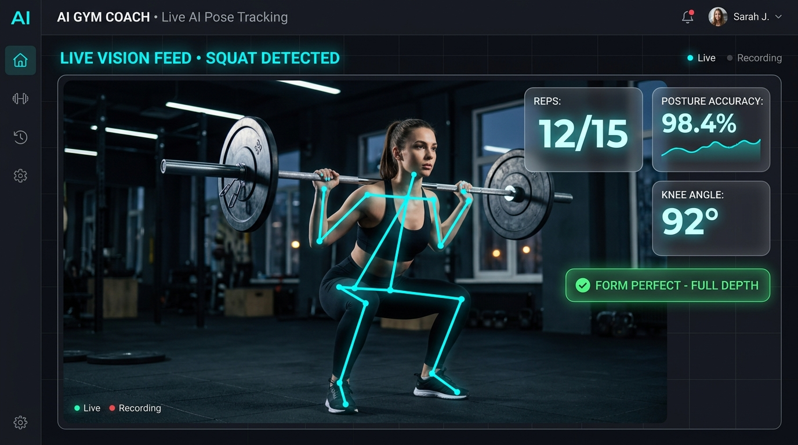
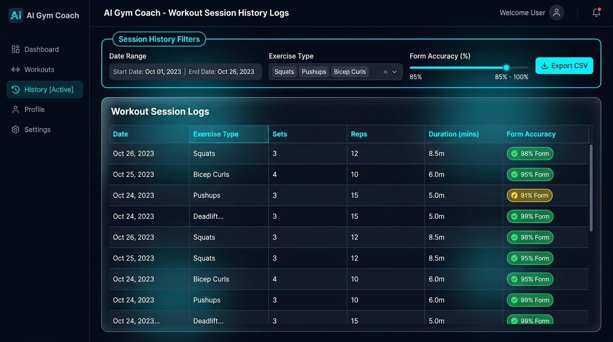
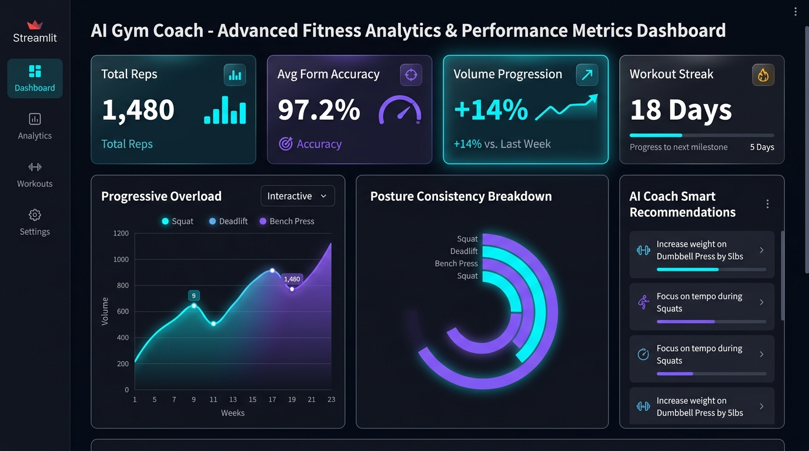

# 🏋️‍♂️ AI GYM COACH — Landing Page & UI Showcase

[](https://real-time-gym-coach.streamlit.app/)
[](https://ai-real-gym-coach-landing-page.vercel.app/)
[](https://github.com/saarthak-pandit27/AI-Real-Time-GYM-Coach)
[](#)

A high-tech, responsive, dark-mode landing page and interactive showcase for **AI GYM COACH** — an intelligent real-time fitness trainer powered by computer vision (MediaPipe), automated repetition counting, joint posture feedback, and session analytics.

---

## 🌟 Key Features

- **🎮 Interactive Hero AI Simulator**: Built-in HTML5 Canvas pose tracking simulator demonstrating real-time MediaPipe joint wireframe detection, rep counts, and form accuracy feedback directly on the landing page.
- **🖼️ High-Fidelity UI Interface Showcase**: Step-by-step visual walkthrough demonstrating user profile setup, exercise selection, live vision tracking, and historical session logs.
- **📊 Comprehensive Analytics Dashboard**: Tabbed dashboard displaying session logs, search filters, progressive overload volume charts, and form consistency breakdowns.
- **✨ Glassmorphic Design System**: Modern futuristic dark theme (`#060913`) built with CSS design tokens, smooth micro-animations, neon cyan/purple accents, and floating HUD widgets.
- **📱 Fully Responsive**: Optimized layout for desktop monitors, tablets, and mobile devices with interactive mobile drawer navigation.

---

## 📸 Interface Showcase

| Workflow Step | Interface Preview |
| :--- | :--- |
| **Step 01: Profile Setup**<br>Configure user target reps, set targets, and exercise preferences. |  |
| **Step 02: Exercise Configuration**<br>Select exercise mode (Squats, Pushups, Bicep Curls, Overhead Press) & set rest timers. |  |
| **Step 03: Live AI Pose Tracking**<br>Real-time MediaPipe skeletal joint overlays, joint angle feedback (92°), and posture accuracy (`98.4%`). |  |
| **Dashboard: Session History**<br>Searchable workout logs table with accuracy badges and CSV data export. |  |
| **Dashboard: Performance Analytics**<br>Volume progression charts, posture distribution graphs, and AI Smart Recommendations. |  |

---

## 🛠️ Tech Stack

### Landing Page
- **HTML5**: Semantic markup with full SEO optimization & accessibility standards.
- **Vanilla CSS3**: Design system with CSS variables, custom glassmorphism, flexbox/grid responsive layouts, and CSS keyframe animations.
- **JavaScript (ES6+)**: Interactive Canvas pose simulator engine, tab navigation state, counter scroll triggers, and mobile menu toggles.
- **Hosting**: Deployed on Vercel.

### Core Application Integration
- **Streamlit**: Python web application framework.
- **MediaPipe Pose 2.0**: High-precision 33-point skeletal landmark detection engine.
- **OpenCV & Python**: Real-time video frame processing, joint angle calculations, and rep state machine.

---

## 🚀 Local Development Setup

To view and develop the landing page locally:

1. **Clone the repository:**
   ```bash
   git clone https://github.com/saarthak-pandit27/AI-Real-Gym-Coach-Landing-Page.git
   cd AI-Real-Gym-Coach-Landing-Page
   ```

2. **Run a local HTTP server:**
   ```bash
   # Using Python 3
   python3 -m http.server 8000
   ```

3. **Open in Browser:**
   Navigate to `http://localhost:8000` in your browser.

Alternatively, you can open [`index.html`](index.html) directly in any web browser.

---

## 🔗 Project Links

- **Live Landing Page**: [ai-real-gym-coach-landing-page.vercel.app](https://ai-real-gym-coach-landing-page.vercel.app/)
- **Live Streamlit App**: [real-time-gym-coach.streamlit.app](https://real-time-gym-coach.streamlit.app/)
- **Main App GitHub Repo**: [saarthak-pandit27/AI-Real-Time-GYM-Coach](https://github.com/saarthak-pandit27/AI-Real-Time-GYM-Coach)

---

## 👤 Author

Developed by **Saarthak Pandit**
- GitHub: [@saarthak-pandit27](https://github.com/saarthak-pandit27)
